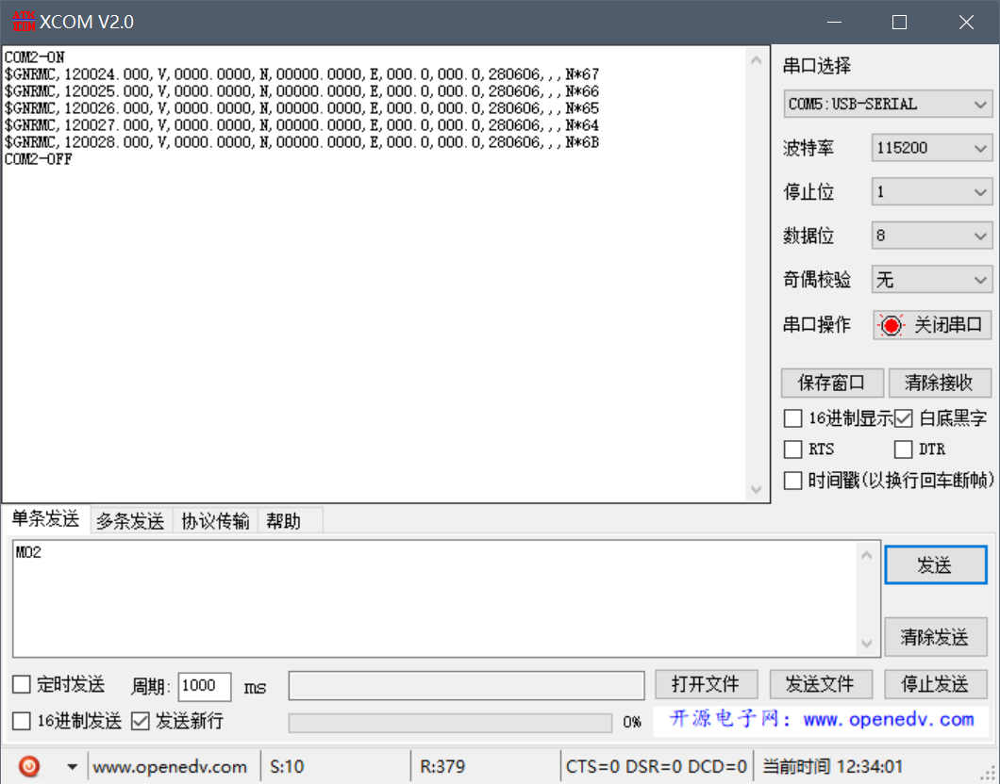
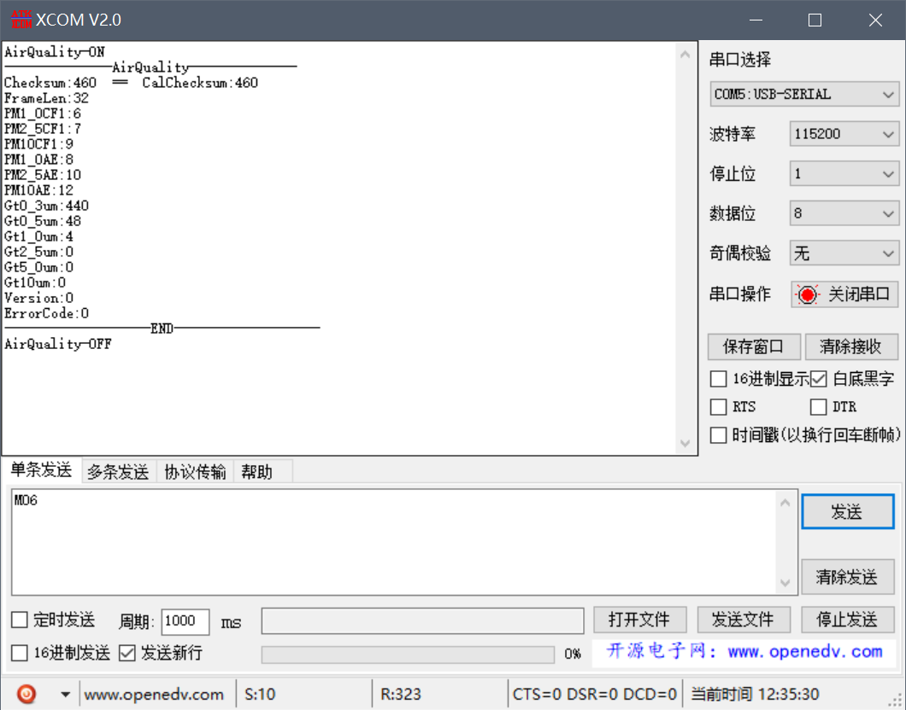

# STC8-Airsensor
**STC8 with PMS7003 and GPS**

The collected info will send by uart to esp32, see more detail on [here](https://github.com/windfallw/ESP32-Air-Monitor).

LCD display some info as follow

## 串口调试

There also provide a **stupid** repl for debug usage.

Send `M02 or M05` to show GPS original data, if you want to see parsed data please use lcd.

Send `M03` to show pms7003 original data, `M06` to show parsed data.

### 其它

`M01` will show your sent message twice, it is use to check working status.

`M04` use to show data receive from esp32 .

`M07` use to switch on lcd.

All the cmd send again will do opposite thing.

